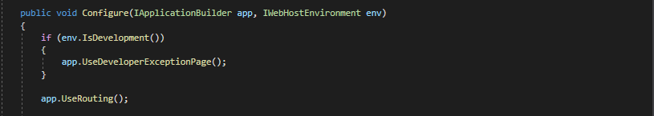
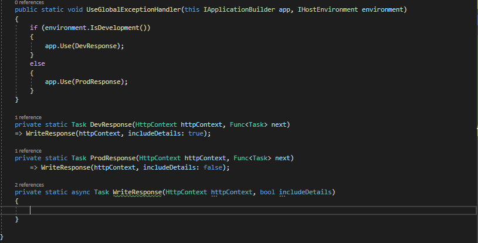
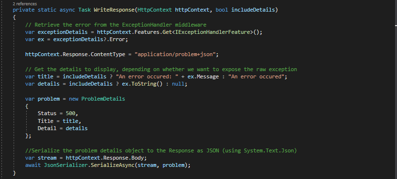
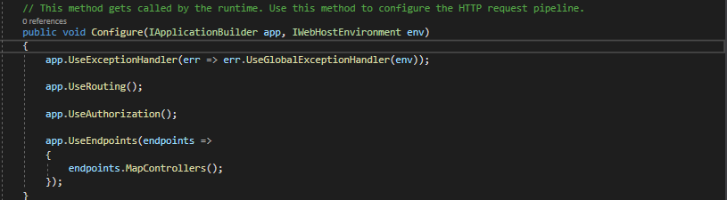

# dotnetcore3.1_global_exceptionhandling 

## Used Technologies

1. dotnetcore 3.1

## Quick Started

1. Checkout the code.
2. Open a cmd inside the 'GlobalExceptionHandling' folder where you cloned the code.
3. Run 'dotnet run --project ./GlobalExceptionHandling.csproj' or 'dotnet run'
4. Open a browser and type 'https://localhost:5000/weatherforecast'
5. Uncomment the line no 31 in WeatherForecastController.cs to simulate an error. Rerun the app and refresh the page.
6. Change the 'ASPNETCORE_ENVIRONMENT' in launch.settings.json to simulate Production enviorenment. Rerun the app and refresh the page.

## Getting Started

Create a web api project and navigate to the Configure method. There exception handling done only for development enviorenment. Though there is no exception handling for production enviorenment,
ASP.NET Core catch the exception from it's infrastructure, log it and return a blank 500 page to client.

But for production it should be handled more gracefully. There are 2 options. 
1. Write custom exception handler.
2. Use Built-in middleware.

Second approach is the safer option since it handles most of the edge cases within it self.

First add GlobalExceptionHandler class.Then add UseGlobalExceptionHandler function. In WriteResponse method write details flag is set based on the environment.

Finally implement the Write response method. This retrieves exception from ExceptionHandlerMiddleware using IExceptionHandlerFeature and build a ProblemDetails object and write the object to response stream.

Finally add it to the HTTP Request pipeline.

Then uncomment line 31 in WeatherForecastController to simulate an exception. In this case all the exception details will be displayed.
Finally simulate the Production enviorenment by changing the 'ASPNETCORE_ENVIRONMENT' to 'Production' in launch.Settings.json file. Only the 'title' and 'status' will be displayed in this scenario since it simulate the production enviorenment.

